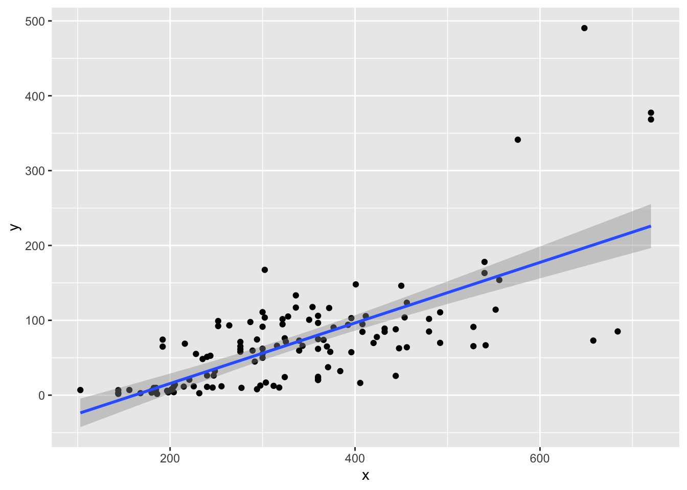
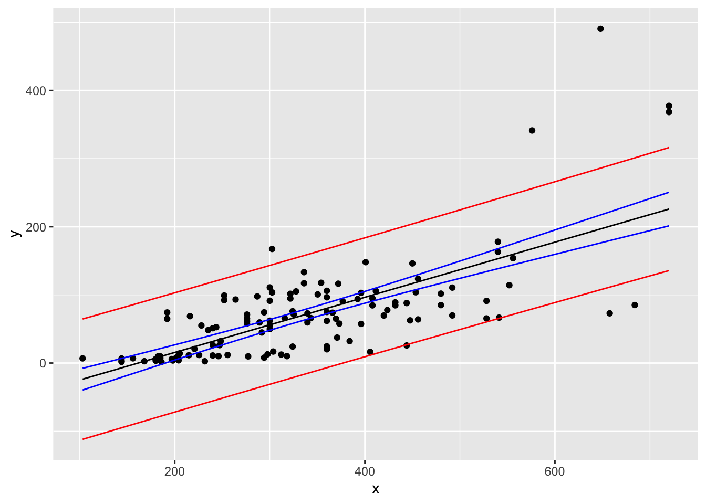
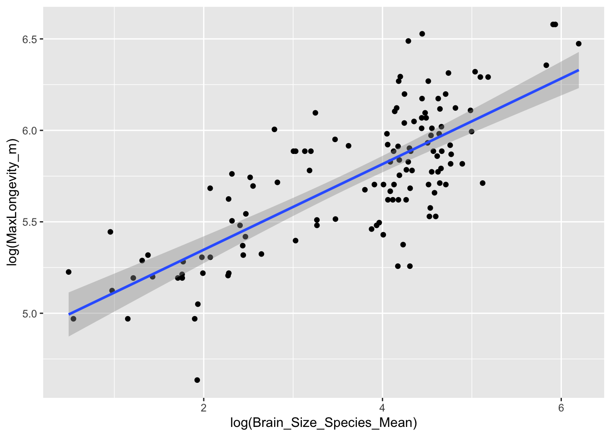

## R Markdown

This is an R Markdown document. Markdown is a simple formatting syntax for authoring HTML, PDF, and MS Word documents. For more details on using R Markdown see <http://rmarkdown.rstudio.com>.

When you click the **Knit** button a document will be generated that includes both content as well as the output of any embedded R code chunks within the document. You can embed an R code chunk like this:


```r
summary(cars)
```

```
##      speed           dist       
##  Min.   : 4.0   Min.   :  2.00  
##  1st Qu.:12.0   1st Qu.: 26.00  
##  Median :15.0   Median : 36.00  
##  Mean   :15.4   Mean   : 42.98  
##  3rd Qu.:19.0   3rd Qu.: 56.00  
##  Max.   :25.0   Max.   :120.00
```

## Including Plots

You can also embed plots, for example:


Note that the `echo = FALSE` parameter was added to the code chunk to prevent printing of the R code that generated the plot.

<!-- [1] Write a simple R function, Z.prop.test(), that can perform one- or two-sample Z-tests for proportion data -->


```r
z.prop.test <- function(p1, n1, p0, p2= NULL, n2= NULL, alternative="two.tailed", conf.level=0.95){
  #error messages for rule of thumb
   if (n1*p0 < 5)
  {
  print("Non Normal!")
  }
if (n1*(1-p0) < 5)
  {
  print("Non Normal!")
  }
#only if using p2 and n2
if (!is.null(n2))
{
  if (n2*p0 < 5)
  {
  print("Non Normal!")
  }
  if (n2*(1-p0) < 5)
  {
  print("Non Normal!")
  }
  # this is the function for z test (no errors)
  if (alternative == "two.tailed")
  {
    z<- (p1-p0)/sqrt((p0*(1-p0))/n1) #z score
    p<- pnorm(z, lower.tail = TRUE) #p value
    lwr <- (p1-qnorm(conf.level) * sqrt(p1*(1-p1))/n1) #confidence intervals
    upr <- (p1+qnorm(conf.level) * sqrt(p1*(1-p1))/n1)
    ci <- c(lwr, upr)
   }
#can be used for one sample, when n2 and p2 are null
  if (is.null(n2)|is.null(p2))
  {
    z<- (p1-p0)/sqrt((p0*(1-p0))/n1)
    p<- pnorm(z, lower.tail = TRUE)
    lwr <- (p1-qnorm(conf.level) * sqrt(p1*(1-p1))/n1)
    upr <- (p1+qnorm(conf.level) * sqrt(p1*(1-p1))/n1)
    ci <- c(lwr, upr)
  }
#if p1 is less than p2 (two samples)
    if (alternative == "less")
  {
    pstar<- (sum(p1*n1)+sum(p2*n2))/(n1+n2) #for a pooled proportion
    z<- (p2 - p1)/sqrt((pstar * (1-pstar)) * (1/length(n1) + 1/length(n2))) #z score
    p<- 1-pnorm(z, lower.tail = T) + pnorm(z,lower.tail = F) #p value
    lwr <- ((p2-p1)-qnorm(conf.level) * sqrt((p2-p1)*(1-(p2-p1)))/n1) # ci intervals
    upr <- ((p2-p1)+qnorm(conf.level) * sqrt((p2-p1)*(1-(p2-p1)))/n1)
    ci <- c(lwr, upr)
  }
 # p1 is greater than p2 (two samples)
   if (alternative == "greater")
  {
    pstar<- (sum(p1*n1)+sum(p2*n2))/(n1+n2) 
  #this is for a pooled portion
    z<- (p1 - p2)/sqrt((pstar * (1-pstar)) * (1/length(n1) + 1/length(n2))) #z score
    p<- 1-pnorm(z, lower.tail = T) + pnorm(z,lower.tail = F) #p value
    lwr <- ((p1-p2)-qnorm(conf.level) * sqrt((p1-p2)*(1-(p1-p2)))/n1) #ci intervals
    upr <- ((p1-p2)+qnorm(conf.level) * sqrt((p1-p2)*(1-(p1-p2)))/n1)
    ci <- c(lwr, upr)
  }
values<- c("z-stat", z, "p value", p, "conf. intervals", ci)
print(values)
}
}
```

<!-- [2] The dataset from Kamilar and Cooper has in it a large number of variables related to life history and body size. For this exercise, the end aim is to fit a simple linear regression model to predict longevity (MaxLongevity_m) measured in months from species’ brain size (Brain_Size_Species_Mean) measured in grams. Do the following for both longevity~brain size and log(longevity)~log(brain size): -->


```r
library(curl)
```

```
## Using libcurl 7.64.1 with LibreSSL/2.8.3
```

```r
library(ggplot2)
#loading the packages and loading the data (below)
f <- curl('https://raw.githubusercontent.com/fuzzyatelin/fuzzyatelin.github.io/master/AN588_Fall21/KamilarAndCooperData.csv')
d <- read.csv(f, stringsAsFactors = FALSE, header = TRUE)
head(d)
```

```
##               Scientific_Name          Family          Genus      Species
## 1 Allenopithecus_nigroviridis Cercopithecidae Allenopithecus nigroviridis
## 2         Allocebus_trichotis Cercopithecidae      Allocebus    trichotis
## 3           Alouatta_belzebul        Atelidae       Alouatta     belzebul
## 4             Alouatta_caraya        Atelidae       Alouatta       caraya
## 5            Alouatta_guariba        Atelidae       Alouatta      guariba
## 6           Alouatta_palliata        Atelidae       Alouatta     palliata
##   Brain_Size_Species_Mean Brain_Size_Female_Mean   Brain_size_Ref
## 1                   58.02                  53.70 Isler et al 2008
## 2                      NA                     NA                 
## 3                   52.84                  51.19 Isler et al 2008
## 4                   52.63                  47.80 Isler et al 2008
## 5                   51.70                  49.08 Isler et al 2008
## 6                   49.88                  48.04 Isler et al 2008
##   Body_mass_male_mean Body_mass_female_mean Mass_Dimorphism
## 1                6130                  3180           1.928
## 2                  92                    84           1.095
## 3                7270                  5520           1.317
## 4                6525                  4240           1.539
## 5                5800                  4550           1.275
## 6                7150                  5350           1.336
##                 Mass_Ref MeanGroupSize AdultMales AdultFemale AdultSexRatio
## 1       Isler et al 2008            NA         NA          NA            NA
## 2 Smith and Jungers 1997          1.00       1.00         1.0            NA
## 3       Isler et al 2008          7.00       1.00         1.0          1.00
## 4       Isler et al 2008          8.00       2.30         3.3          1.43
## 5       Isler et al 2008          6.53       1.37         2.2          1.61
## 6       Isler et al 2008         12.00       2.90         6.3          2.17
##                                                     Social_Organization_Ref
## 1                                                                          
## 2                                                             Kappeler 1997
## 3                                                       Campbell et al 2007
## 4 van Schaik et al. 1999; Kappeler and Pereira 2003; Nunn & van Schaik 2000
## 5                                                       Campbell et al 2007
## 6 van Schaik et al. 1999; Kappeler and Pereira 2003; Nunn & van Schaik 2000
##   InterbirthInterval_d Gestation WeaningAge_d MaxLongevity_m LitterSz
## 1                   NA        NA       106.15          276.0     1.01
## 2                   NA        NA           NA             NA     1.00
## 3                   NA        NA           NA             NA       NA
## 4               337.62       187       323.16          243.6     1.01
## 5                   NA        NA           NA             NA       NA
## 6               684.37       186       495.60          300.0     1.02
##    Life_History_Ref GR_MidRangeLat_dd Precip_Mean_mm Temp_Mean_degC AET_Mean_mm
## 1 Jones et al. 2009             -0.17         1574.0           25.2      1517.8
## 2                              -16.59         1902.3           20.3      1388.2
## 3                               -6.80         1643.5           24.9      1286.6
## 4 Jones et al. 2009            -20.34         1166.4           22.9      1193.1
## 5                              -21.13         1332.3           19.6      1225.7
## 6 Jones et al. 2009              6.95         1852.6           23.7      1300.0
##   PET_Mean_mm       Climate_Ref HomeRange_km2      HomeRangeRef DayLength_km
## 1      1589.4 Jones et al. 2009            NA                             NA
## 2      1653.7 Jones et al. 2009            NA                             NA
## 3      1549.8 Jones et al. 2009            NA                             NA
## 4      1404.9 Jones et al. 2009            NA                           0.40
## 5      1332.2 Jones et al. 2009          0.03 Jones et al. 2009           NA
## 6      1633.9 Jones et al. 2009          0.19 Jones et al. 2009         0.32
##       DayLengthRef Territoriality Fruit Leaves Fauna             DietRef1
## 1                              NA    NA                                  
## 2                              NA    NA                                  
## 3                              NA  57.3   19.1   0.0 Campbell et al. 2007
## 4 Nunn et al. 2003             NA  23.8   67.7   0.0 Campbell et al. 2007
## 5                              NA   5.2   73.0   0.0 Campbell et al. 2007
## 6 Nunn et al. 2003         0.6506  33.1   56.4   0.0 Campbell et al. 2007
##   Canine_Dimorphism Canine_Dimorphism_Ref  Feed  Move  Rest Social
## 1             2.210   Plavcan & Ruff 2008    NA    NA    NA     NA
## 2                NA                          NA    NA    NA     NA
## 3             1.811   Plavcan & Ruff 2008 13.75 18.75 57.30  10.00
## 4             1.542   Plavcan & Ruff 2008 15.90 17.60 61.60   4.90
## 5             1.783   Plavcan & Ruff 2008 18.33 14.33 64.37   3.00
## 6             1.703   Plavcan & Ruff 2008 17.94 12.32 66.14   3.64
##    Activity_Budget_Ref
## 1                     
## 2                     
## 3 Campbell et al. 2007
## 4 Campbell et al. 2007
## 5 Campbell et al. 2007
## 6 Campbell et al. 2007
```

```r
#preparing the data and removing "na"
c<-na.omit(d) 
#making the data fram compatible with ggplot
h<-data.frame(c) 
x<-d$MaxLongevity_m 
y<-d$Brain_Size_Species_Mean 
#identifying the variables
```


```r
#using lm
M1<-lm(data = d, y~x) 
M1
```

```
## 
## Call:
## lm(formula = y ~ x, data = d)
## 
## Coefficients:
## (Intercept)            x  
##    -65.3627       0.4046
```

```r
summary(M1)
```

```
## 
## Call:
## lm(formula = y ~ x, data = d)
## 
## Residuals:
##      Min       1Q   Median       3Q      Max 
## -127.756  -25.855   -3.442   19.405  293.608 
## 
## Coefficients:
##              Estimate Std. Error t value Pr(>|t|)    
## (Intercept) -65.36266   13.05712  -5.006 1.83e-06 ***
## x             0.40458    0.03657  11.064  < 2e-16 ***
## ---
## Signif. codes:  0 '***' 0.001 '**' 0.01 '*' 0.05 '.' 0.1 ' ' 1
## 
## Residual standard error: 52.4 on 126 degrees of freedom
##   (85 observations deleted due to missingness)
## Multiple R-squared:  0.4928,	Adjusted R-squared:  0.4887 
## F-statistic: 122.4 on 1 and 126 DF,  p-value: < 2.2e-16
```

```r
#r2 is .4887
ggM1<-ggplot(data = d, aes(x = x, y = y)) + geom_point() + geom_smooth(method = "lm", formula = y ~ x)
ggM1
```

```
## Warning: Removed 85 rows containing non-finite values (stat_smooth).
```

```
## Warning: Removed 85 rows containing missing values (geom_point).
```



```r
#ggplot of the first model
```

<!-- Identify and interpret the point estimate of the slope (β1 -->
<!-- ), as well as the outcome of the test associated with the hypotheses H0: β1 -->
<!--  = 0; HA: β1 -->
<!--  ≠ 0. Also, find a 90 percent CI for the slope (β1 -->
<!-- ) parameter. -->


```r
#finding beta0 and beta1 
t1 <- unlist(M1$coefficients)
# unlisting is used to get coeficients out of the model
beta0<-round(t1[1],digits = 2)
beta0
```

```
## (Intercept) 
##      -65.36
```

```r
beta1<-round(t1[2],digits = 2)
beta1
```

```
##   x 
## 0.4
```

```r
#to find the 90% CI
ci.slope<-confint(M1, level = 0.9)
ci.slope
```

```
##                    5 %        95 %
## (Intercept) -86.998791 -43.7265361
## x             0.343982   0.4651695
```
<!-- Using your model, add lines for the 90 percent confidence and prediction interval bands on the plot and add a legend to differentiate between the lines. -->


```r
#confidence intervals for 90%
ci <- predict(M1, newdata = data.frame(size = d$Brain_Size_Species_Mean), interval = "confidence", 
    level = 0.90)  
ci.frame<-data.frame(ci)
#finding the prediction intervals for 90%
pi <- predict(M1, newdata = data.frame(size = d$Brain_Size_Species_Mean), interval = "prediction", 
    level = 0.90)  
pi.frame<-data.frame(pi)
#combining the original x and y values
r<-cbind(x, y) 
#combining the x and y values, and the ci and pi data frames!
New<-cbind(r, ci.frame, pi.frame)
#naming the columns
names(New) <- c("x", "y", "CIfit", "CIlower", "CIupper", "PIfit", "PIlower", "PIupper")
head(New)
```

```
##       x     y    CIfit  CIlower  CIupper    PIfit   PIlower  PIupper
## 1 276.0 58.02 46.30024 37.86345 54.73703 46.30024 -40.92998 133.5305
## 2    NA    NA       NA       NA       NA       NA        NA       NA
## 3    NA 52.84       NA       NA       NA       NA        NA       NA
## 4 243.6 52.63 33.19199 23.76870 42.61528 33.19199 -54.13916 120.5231
## 5    NA 51.70       NA       NA       NA       NA        NA       NA
## 6 300.0 49.88 56.01006 48.06662 63.95350 56.01006 -31.17383 143.1939
```

```r
#making the ggplot
gMod2<-ggplot(data = New, aes(x = x, y = y)) + geom_point() + 
  geom_line(data = New, aes(x = x, y = CIfit), colour = "black") +
  geom_line(data = New, aes(x = x, y = CIlower), colour = "blue") +
  geom_line(data = New, aes(x = x, y = CIupper), colour = "blue") +
  geom_line(data = New, aes(x = x, y = PIlower), colour = "red") +
  geom_line(data = New, aes(x = x, y = PIupper), colour = "red")
gMod2
```

```
## Warning: Removed 85 rows containing missing values (geom_point).
```

```
## Warning: Removed 66 row(s) containing missing values (geom_path).

## Warning: Removed 66 row(s) containing missing values (geom_path).

## Warning: Removed 66 row(s) containing missing values (geom_path).

## Warning: Removed 66 row(s) containing missing values (geom_path).

## Warning: Removed 66 row(s) containing missing values (geom_path).
```



<!-- [3]Produce a point estimate and associated 90 percent PI for the longevity of a species whose brain weight is 800 gm. Do you trust the model to predict observations accurately for this value of the explanatory variable? Why or why not? -->


```r
#point estimate
predict(M1, newdata = data.frame(x = 800))
```

```
##        1 
## 258.2979
```

```r
#258.2979
#PIs
predict(M1, newdata = data.frame(x = 800), interval = "prediction",level = 0.90)
```

```
##        fit      lwr      upr
## 1 258.2979 166.6757 349.9201
```

```r
#fit = 258.2979, lwr = 166.6757, upr = 349.9201
#I don't thik this model is accurate because it is meant to predict brain sizes and longevity of animals with a similar brain size. 800 grams is so much more than the brain sizes in the data set,I don't think the same relationship would exist. 
```

<!-- log model -->


```r
#log transform the variables and make them into a data frame 
r1<-log(d$MaxLongevity_m)
r2<-log(d$Brain_Size_Species_Mean)
df2<-as.data.frame(cbind(r2,r1))
#transformed model (below)
logM1<-lm(data = d, log(y)~log(x))
logM1
```

```
## 
## Call:
## lm(formula = log(y) ~ log(x), data = d)
## 
## Coefficients:
## (Intercept)       log(x)  
##      -10.50         2.47
```

```r
summary(logM1)
```

```
## 
## Call:
## lm(formula = log(y) ~ log(x), data = d)
## 
## Residuals:
##     Min      1Q  Median      3Q     Max 
## -1.9931 -0.6161  0.0787  0.6272  1.8213 
## 
## Coefficients:
##             Estimate Std. Error t value Pr(>|t|)    
## (Intercept) -10.5019     1.0808  -9.717   <2e-16 ***
## log(x)        2.4703     0.1879  13.148   <2e-16 ***
## ---
## Signif. codes:  0 '***' 0.001 '**' 0.01 '*' 0.05 '.' 0.1 ' ' 1
## 
## Residual standard error: 0.807 on 126 degrees of freedom
##   (85 observations deleted due to missingness)
## Multiple R-squared:  0.5784,	Adjusted R-squared:  0.5751 
## F-statistic: 172.9 on 1 and 126 DF,  p-value: < 2.2e-16
```

```r
#the r2 is now 0.5751, higher than regular model
#making the ggplot
ggM2 <- ggplot(data=df2, aes(x=r2,y=r1))+xlab("log(Brain_Size_Species_Mean)")+ylab("log(MaxLongevity_m)")+ geom_point() + geom_smooth(method="lm", fullrange=TRUE)
ggM2
```

```
## `geom_smooth()` using formula 'y ~ x'
```

```
## Warning: Removed 85 rows containing non-finite values (stat_smooth).
```

```
## Warning: Removed 85 rows containing missing values (geom_point).
```




```r
#finding beta0 and beta1 
t1 <- unlist(logM1$coefficients)
# unlist to get coeficients out of the model
beta0<-round(t1[1],digits = 2)
beta0
```

```
## (Intercept) 
##       -10.5
```

```r
beta1<-round(t1[2],digits = 2)
beta1
```

```
## log(x) 
##   2.47
```

```r
#find the 90% confidence intervals
ci.slope<-confint(M1, level = 0.9)
ci.slope
```

```
##                    5 %        95 %
## (Intercept) -86.998791 -43.7265361
## x             0.343982   0.4651695
```

```r
#CI for 90%
ci <- predict(logM1, newdata = data.frame(size = d$Brain_Size_Species_Mean), interval = "confidence", 
    level = 0.90)  
logci.frame<-data.frame(ci)
#PI for 90%
pi <- predict(logM1, newdata = data.frame(size = d$Brain_Size_Species_Mean), interval = "prediction", 
    level = 0.90)  
logpi.frame<-data.frame(pi)
#combine the original x and y values
r<-cbind(x, y) 
#combining the x and y values, and the ci and pi data frames
logNew<-cbind(r, ci.frame, pi.frame)
#naming the columns
names(logNew) <- c("x", "y", "CIfit", "CIlower", "CIupper", "PIfit", "PIlower", "PIupper")
head(logNew)
```

```
##       x     y    CIfit  CIlower  CIupper    PIfit   PIlower  PIupper
## 1 276.0 58.02 46.30024 37.86345 54.73703 46.30024 -40.92998 133.5305
## 2    NA    NA       NA       NA       NA       NA        NA       NA
## 3    NA 52.84       NA       NA       NA       NA        NA       NA
## 4 243.6 52.63 33.19199 23.76870 42.61528 33.19199 -54.13916 120.5231
## 5    NA 51.70       NA       NA       NA       NA        NA       NA
## 6 300.0 49.88 56.01006 48.06662 63.95350 56.01006 -31.17383 143.1939
```

```r
#making the ggplot
loggMod2<-ggplot(data = logNew, aes(x = x, y = y)) + geom_point() + 
  geom_line(data = logNew, aes(x = x, y = CIfit), colour = "black") +
  geom_line(data = logNew, aes(x = x, y = CIlower), colour = "blue") +
  geom_line(data = logNew, aes(x = x, y = CIupper), colour = "blue") +
  geom_line(data = logNew, aes(x = x, y = PIlower), colour = "red") +
  geom_line(data = logNew, aes(x = x, y = PIupper), colour = "red")
loggMod2
```

```
## Warning: Removed 85 rows containing missing values (geom_point).
```

```
## Warning: Removed 66 row(s) containing missing values (geom_path).

## Warning: Removed 66 row(s) containing missing values (geom_path).

## Warning: Removed 66 row(s) containing missing values (geom_path).

## Warning: Removed 66 row(s) containing missing values (geom_path).

## Warning: Removed 66 row(s) containing missing values (geom_path).
```


```r
#point estimate
predict(logM1, newdata = data.frame(x = 800))
```

```
##        1 
## 6.010783
```

```r
#258.2979
#PIs
predict(logM1, newdata = data.frame(x = 800), interval = "prediction",level = 0.90)
```

```
##        fit      lwr      upr
## 1 6.010783 4.636508 7.385059
```

Looking at your two models, which do you think is better? Why?
#The log model appears to works better - it gave a higher r2 value, which means a strong linear relationship.
